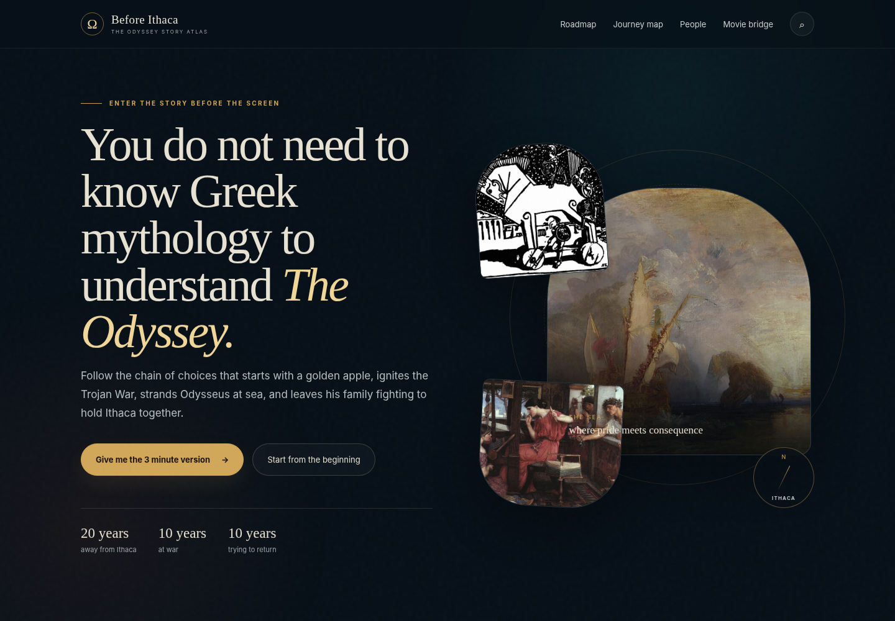

# Before Ithaca: The Odyssey Story Atlas

<p align="center">
  
</p>

<p align="center">
  
  
  
</p>

<p align="center">
  A cinematic, interactive atlas that traces the mythic chain before Odysseus reaches Ithaca.
</p>

---

## Overview

**Before Ithaca** is a standalone web experience about the Odyssey and the wider Trojan War story world. It presents the events as a flowing story, supported by illustrated timeline cards, character profiles, relationship maps, and interactive scene diagrams.

The project is designed to run from one HTML file, so it can be opened locally, shared easily, or hosted with GitHub Pages.

## Features

- Interactive roadmap of the story before and after Troy
- Timeline cards with scene artwork and short explanations
- Clickable character network with highlighted relationships
- Character detail cards with images, roles, tensions, and related story cards
- Scene-level mini relationship diagrams under story cards
- Read/unread toggle for story progress
- Responsive layout for desktop and mobile

## Live Demo

Open the published GitHub Pages site:

```text
https://maninka123.github.io/before-ithaca-odyssey-story-atlas/
```

## Run Locally

Open this file directly in a browser:

```text
Before_Ithaca_Standalone.html
```

Or run a small local server:

```bash
python3 -m http.server 8765
```

Then visit:

```text
http://127.0.0.1:8765/Before_Ithaca_Standalone.html
```

## Project Files

```text
index.html                     GitHub Pages entry page
Before_Ithaca_Standalone.html   Main standalone website
odyssey_preview.png             Preview image for README and sharing
START_HERE_Before_Ithaca.txt    Quick local-use note
README.md                       Project documentation
```
