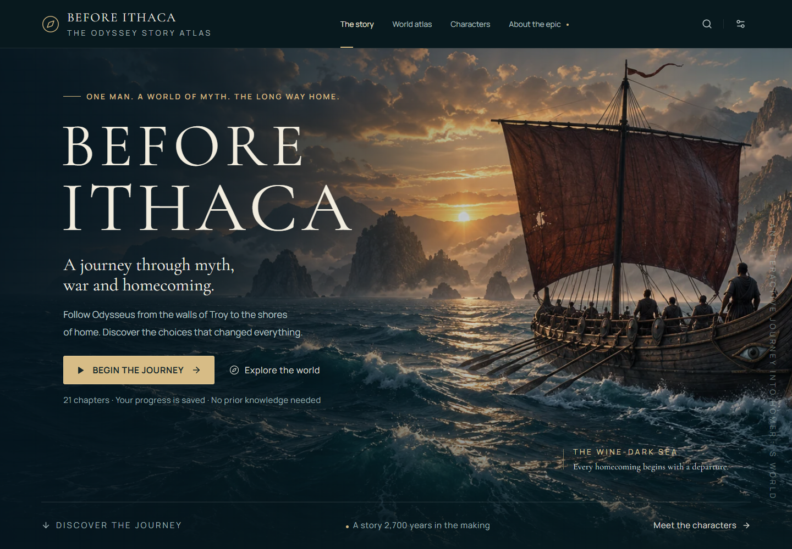
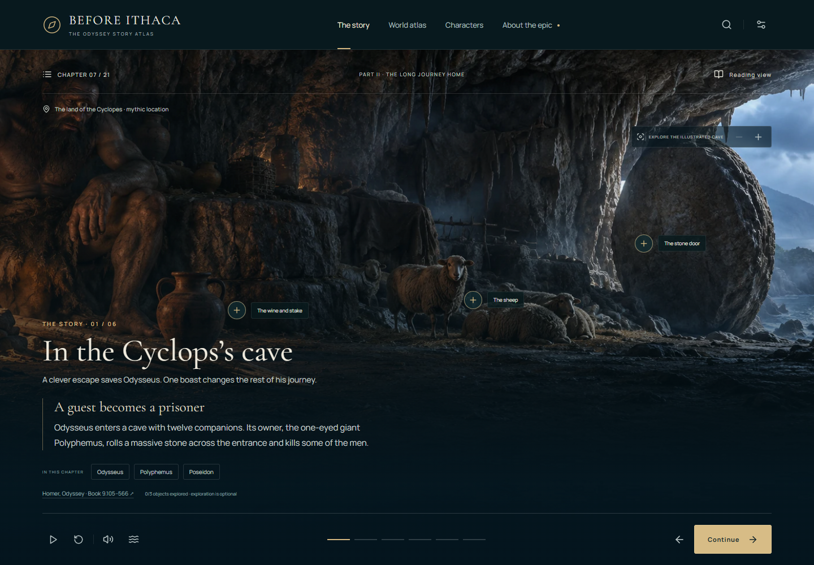
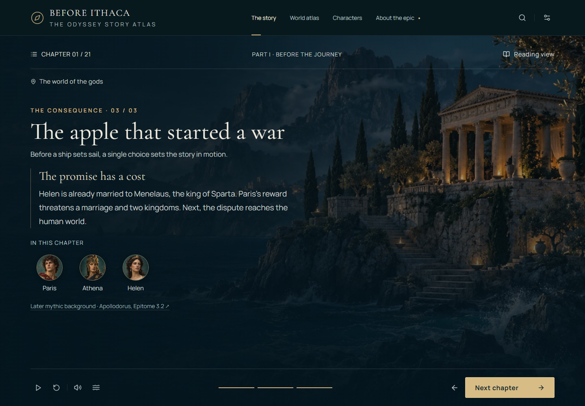
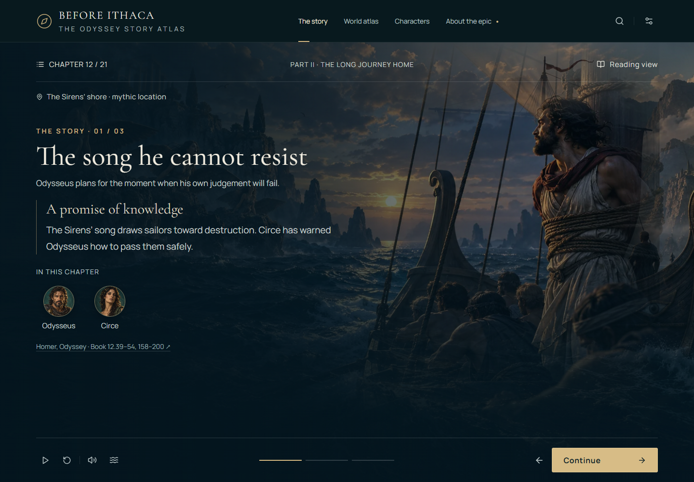
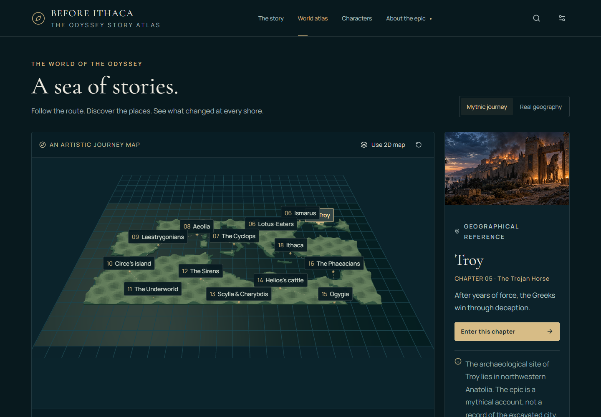
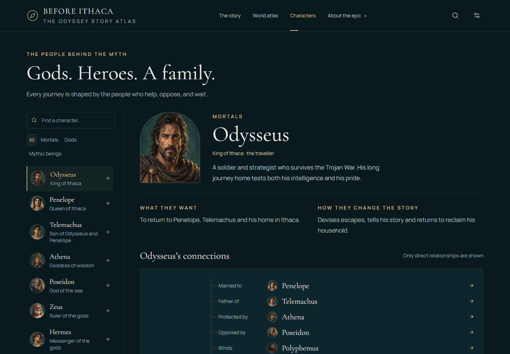
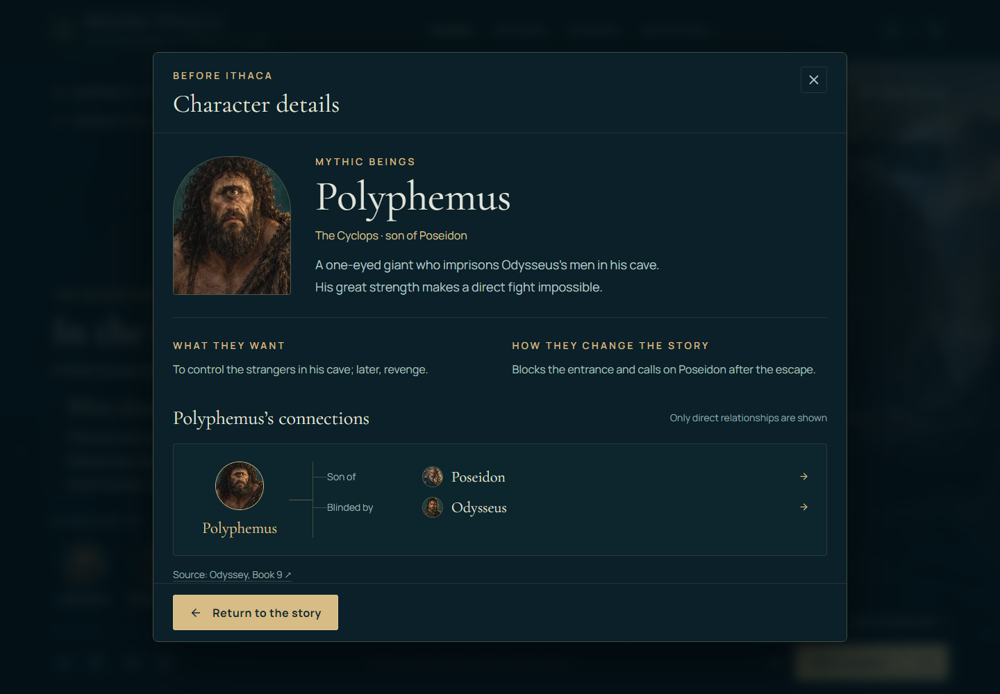

# Before Ithaca

**The Odyssey: a journey through myth, war and homecoming.**

[Open the story atlas](https://maninka123.github.io/before-ithaca-odyssey-story-atlas/)

An interactive story atlas for people discovering Odysseus's story for the first time. Follow 21 clear chapters, explore an illustrated Cyclops escape, travel through a 3D Mediterranean atlas, and meet the gods and people who shape the homecoming.



## Explore the redesign

- **The story:** larger, readable text; short narrative beats; circular character portraits; and 18 distinct chapter scenes blended into the three parts' landscapes. Each part's opening chapter keeps its original background.
- **The Cyclops:** inspect the stone door, wine and sheep to understand the escape. Exploration is optional.
- **World atlas:** orbit, zoom and pan the 3D map, or use the 2D view. Mythic placements and real geographical references are kept distinct.
- **Characters:** chapter portraits open a details popup you can close to continue at the same reading position. Explore related people inside it, or use the separate character explorer for all 21 profiles and chapter links.
- **Your pace:** a consistent cinematic frame that fills the screen, anchored navigation, manual progression, replay, reading view, reduced motion, quiet graphics and saved progress. Longer text scrolls inside the frame.
- **Your choice of sound:** device read-aloud and opt-in sea ambience. The complete story works silently.
- **Ancient sources:** visible book references, qualified mythology and an optional route explaining Homer's epic order.













## Run locally

Use Node.js 22 or newer.

```sh
npm install
npm run dev
```

Open the local address printed by Vite (normally `http://127.0.0.1:5173`). The redesigned source requires the development server or a built static site; opening the source HTML with `file://` is not supported.

```sh
npm run build
npm run preview
```

The build is in `dist/`. The GitHub Pages workflow checks Chrome, Firefox and WebKit, builds the app, and publishes that directory when pushed to `main`, with Pages configured to use GitHub Actions.

## Verify

```sh
npx playwright install firefox webkit
npm test
```

The suite uses installed Chrome and Edge plus Playwright Firefox and WebKit. It checks the complete story, cave objects, restored progress, epic-order navigation, character links, maps, keyboard controls and mobile layouts. See [verification notes](docs/verification/REPORT.md) for actual results and limitations. `npm run format` formats the source. `node scripts/inspect.mjs` refreshes the screenshots while the dev server runs.

## Project guide

- [Existing experience audit](docs/project/EXISTING_APP_AUDIT.md)
- [Narrative structure and sources](docs/project/NARRATIVE_STRUCTURE.md)
- [Architecture and remaining 3D work](docs/project/ARCHITECTURE.md)
- [Artwork, fonts and data provenance](docs/artwork/PROVENANCE.md)
- [Mobile screenshot](docs/screenshots/landing-mobile.png)
- [Folder guide](docs/README.md)

The root contains the README, app entry and required package/build/test configuration. Source, assets, documentation, utilities, tests and the preserved original edition each have their own folder. Build output stays in `dist/`, and ignored temporary files stay in `.cache/`.

The story scenes are cinematic illustrations, with a richer interactive Cyclops chapter. The atlas is rendered in Three.js/React Three Fiber. Fully modeled chapter environments, spatial cave exploration, animated characters, recorded narration and music remain future work.

The original standalone reading edition and its old preview are preserved in `legacy/`. The former standalone URL opens the new app. The redesigned site has no backend, account system or frontend API secrets.
